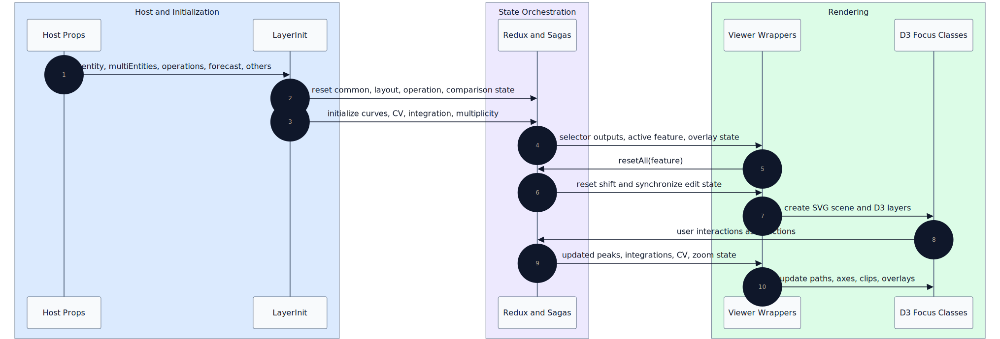

# Frontend Architecture

This document describes the internal runtime architecture of `@complat/react-spectra-editor`. It covers state, sagas, rendering, data transformation, multi-curve workflows, forecast workflows, and host integration contracts.

Host props and callbacks are listed in [High-Level Overview](high-level-overview.md#data-entry-and-exit-points). This document maps those contracts to runtime code.

## Redux Architecture

The Redux store is created in [`src/app.js`](../../src/app.js) and uses the combined reducer from [`src/reducers/index.js`](../../src/reducers/index.js). The store is shared by the editor tree through `react-redux` and is the central coordination point for rendering state, editing state, multi-curve state, forecast state, and host-facing workflow state.

  

 

The root reducer combines these state domains:

| Domain | Reducers | Runtime responsibility |
|---|---|---|
| Rendering and navigation | `layout`, `ui`, `scan`, `threshold`, `wavelength`, `axesUnits`, `detector` | Determines active layout, viewer mode, sweep mode, zoom extent, scan target, thresholds, axes, wavelength, and detector display state. |
| Spectrum editing | `editPeak`, `shift`, `integration`, `multiplicity`, `simulation` | Tracks user edits and NMR-specific derived editing state. |
| Multi-curve and CV | `curve`, `cyclicvolta` | Tracks active curve, curve list, CV peak pairs, reference state, current-density mode, and per-curve CV edits. |
| Host integration | `submit`, `forecast`, `jcamp` | Tracks selected submit operation, forecast state, and comparison spectra/callbacks. |
| Metadata and orchestration | `meta`, `status`, `manager` | Stores derived metadata and provides action namespaces used by sagas and reducers. |

`editPeak`, `integration`, and `multiplicity` are undoable reducers. They are wrapped with `redux-undo` and share the action filter in [`src/reducers/undo_redo_config.js`](../../src/reducers/undo_redo_config.js). The undo configuration includes edit actions, integration actions, multiplicity actions, and manager reset actions. Reset-oriented actions clear history so that user-facing undo state stays aligned with the active spectrum and feature.

Action namespaces are defined in [`src/constants/action_type.js`](../../src/constants/action_type.js). They are organized around runtime domains rather than React components: `MANAGER`, `UI`, `EDITPEAK`, `INTEGRATION`, `MULTIPLICITY`, `CURVE`, `CYCLIC_VOLTA_METRY`, `FORECAST`, `JCAMP`, `SUBMIT`, and related display domains. This allows sagas to translate UI-level actions into domain-level mutations without coupling every component directly to every reducer.

Reducers interact operationally through shared action streams. A single action can be handled by multiple reducers and sagas. For example:

- `MANAGER.RESETALL` resets layout/UI-facing state, clears comparison state, resets edit peak state, and triggers saga-managed shift propagation.
- `CURVE.SET_ALL_CURVES` rebuilds `curve.listCurves`, expands threshold state when needed, and triggers multi-entity sagas that initialize CV, integration, multiplicity, and simulation state.
- `UI.SWEEP.SELECT_INTEGRATION` is emitted from UI sweep interactions and consumed by the undoable integration reducer.
- Multiplicity workflows flow through saga actions first, then land in reducer actions with `_RDC` suffixes.

The resulting model is action-driven synchronization: reducers own state mutations, sagas coordinate multi-slice effects, and connected components derive rendering inputs from the current store snapshot.

## Saga Orchestration Architecture

The root saga in [`src/sagas/index.js`](../../src/sagas/index.js) composes all orchestration modules with `yield all([...])`. Sagas exist where a single action must coordinate multiple state domains, derive additional payload data, or translate UI gestures into domain-specific actions.

  

 

The saga modules have distinct runtime roles:

| Saga module | Runtime role |
|---|---|
| [`saga_manager.js`](../../src/sagas/saga_manager.js) | Propagates manager resets into shift resets and initializes integration/simulation state for NMR and integration-enabled layouts. |
| [`saga_ui.js`](../../src/sagas/saga_ui.js) | Translates click, brush, and wheel interactions into edit peak, shift, integration, multiplicity, zoom, and CV actions according to `ui.sweepType`. |
| [`saga_meta.js`](../../src/sagas/saga_meta.js) | Computes peak metadata and DSC metadata reducer payloads. |
| [`saga_multiplicity.js`](../../src/sagas/saga_multiplicity.js) | Coordinates multiplicity-specific mutations and reducer payloads. |
| [`saga_edit_peak.js`](../../src/sagas/saga_edit_peak.js) | Synchronizes edited peaks with shift updates. |
| [`saga_multi_entities.js`](../../src/sagas/saga_multi_entities.js) | Initializes per-curve integrations, multiplicities, simulations, and cyclic voltammetry state from `curve.listCurves`. |

Manager flows start with initialization or viewer resets. `LayerInit` dispatches layout-specific manager actions during `execReset()`. Viewers dispatch `resetAll(feature)` during mount and when their active feature changes. `saga_manager.js` listens to `MANAGER.RESETALL`, reads the current layout and curve state, and emits `MANAGER.RESETSHIFT` with curve metadata. That enriches downstream reducers with layout and multi-curve context.

UI orchestration is driven by `ui.sweepType`. D3 interactions call `clickUiTarget`, `selectUiSweep`, or `scrollUiWheel`. `saga_ui.js` reads the current sweep mode and active `curveIdx`, then emits the domain action. The same click can mean "add peak", "delete peak", "anchor shift", "remove integration", "select multiplicity", or "edit cyclic voltammetry peak" depending on `ui.sweepType`.

Multi-entity orchestration is triggered by `CURVE.SET_ALL_CURVES`. `saga_multi_entities.js` reads `curve.listCurves`, resets CV state, initializes CV area settings from the first curve, creates pair peaks per curve, initializes reference peaks, and populates integration/multiplicity arrays by curve index. This keeps multi-curve rendering, editing overlays, and submit payloads aligned.

## Rendering Pipeline Architecture

Rendering is split between React viewer wrappers and D3 focus classes. React owns component composition, lifecycle entry points, and Redux-connected props. D3 owns the SVG scene graph, scales, axes, paths, overlays, brushing, and interaction hit targets.

  

 

The viewer wrappers are:

- [`ViewerLine`](../../src/components/d3_line/index.js), which wraps `LineFocus`.
- [`ViewerRect`](../../src/components/d3_rect/index.js), which wraps `RectFocus`.
- [`ViewerMulti`](../../src/components/d3_multi/index.js), which wraps `MultiFocus`.

Each wrapper follows the same runtime pattern:

1. Read derived data from Redux selectors and component props.
2. Destroy the previous root SVG under the viewer root when mounting or unmounting.
3. Dispatch `resetAll(feature)` to synchronize Redux with the active feature.
4. Call `drawMain()` to create the SVG shell.
5. Call the focus class `create()` method to mount axes, clips, paths, overlays, brush behavior, and tooltips.
6. On React updates, call the focus class `update()` method with new derived inputs.
7. Update labels and visibility using `drawLabel()` and `drawDisplay()`.

`LineFocus` handles line spectra. It creates the main focus frame, clipping paths, scales, axes, grid, line path, threshold lines, peak overlays, reference overlays, integration overlays, multiplicity overlays, comparison paths, and brush behavior. Its `update()` method recalculates scales and redraws only the affected D3 layers based on stored `shouldUpdate` state.

`RectFocus` follows the same wrapper pattern for MS-oriented rectangular rendering.

`MultiFocus` handles multi-curve and cyclic voltammetry rendering. It selects the active curve, builds `otherLineData`, filters SEC/GC curves by unit compatibility, transforms CV values for current-density display, renders other curves with comparison paths, and manages CV peak/pecker interactions.

D3 helper responsibilities are concentrated in:

- [`src/components/common/draw.js`](../../src/components/common/draw.js): SVG creation, destruction, labels, visibility, and curve arrows.
- [`src/helpers/mount.js`](../../src/helpers/mount.js): SVG groups, axes, clips, paths, threshold lines, markers, compare paths, and overlay containers.
- [`src/helpers/brush.js`](../../src/helpers/brush.js): brush wiring.
- [`src/helpers/compass.js`](../../src/helpers/compass.js): pointer-to-data translation and rescaling helpers.
- [`src/helpers/init.js`](../../src/helpers/init.js): D3 scale, axis, and tooltip initialization.

React does not render the SVG chart declaratively. React provides state and lifecycle signals; D3 mutates the SVG scene. Debug rendering issues by checking Redux-derived viewer props and focus-class D3 state together.

## Data Transformation Pipeline

The editor receives host-provided `entity` objects and transforms them into renderable D3 inputs through a layered pipeline. Hosts convert JCAMP with `FN.ExtractJcamp` before mount; `SpectraEditor` expects shaped `entity` and `multiEntities` props at runtime.

  

 

The pipeline starts in [`src/helpers/chem.js`](../../src/helpers/chem.js):

- `ExtractJcamp(source)` uses `jcampconverter` and preserved JCAMP records to build `{ spectra, features, layout }`.
- Layout-specific feature builders derive peak features, integration data, multiplicity data, simulation data, CV metadata, DSC metadata, and XRD temperature metadata.
- Conversion helpers such as `Convert2Scan`, `Convert2Thres`, `Convert2Peak`, and `convertTopic` produce data used by submit payloads and render selectors.

`LayerInit` consumes `entity.layout` and `entity.features` to initialize reducer state. It does not render the data directly. Rendering input is derived later through `extractParams()` and selectors.

[`extractParams`](../../src/helpers/extractParams.js) resolves:

- `topic`: the spectral `x`/`y` source for the active scan or first spectrum.
- `feature`: either edit peak or auto peak feature depending on threshold edit mode.
- `hasEdit`: whether edit peak data is available.
- `integration` and `multiplicity`: feature-level data used by panels and initialization.

Rendering selectors in [`src/helpers/chem.js`](../../src/helpers/chem.js) convert the selected `topic` and `feature` into D3 inputs:

- `Topic2Seed` applies shift offset and creates renderable points. Integration-enabled layouts receive cumulative `k` values for integration curves.
- `Feature2Peak` derives visible peak markers from feature data, thresholds, and shift offset.
- `ToThresEndPts` derives threshold line endpoints.
- `ToShiftPeaks` derives reference markers.
- `ToFrequency` extracts NMR observe frequency when applicable.
- `GetComparisons` rescales comparison spectra for IR, HPLC UV/VIS, and XRD comparison rendering.
- `Feature2MaxMinPeak` derives cyclic voltammetry max/min/pecker points for multi-curve CV state.

The output of this pipeline is not a single normalized object. It is a set of render-specific inputs consumed by viewer wrappers and focus classes: `seed`, `peak`, `comparisons`, threshold endpoints, shift peaks, integration state, multiplicity state, sweep extent, layout state, axes state, and cyclic voltammetry state.

## Multi-Curve and CV Architecture

Multi-curve behavior is coordinated by the `curve` reducer, `cyclicvolta` reducer, `saga_multi_entities.js`, `MultiJcampsViewer`, `ViewerMulti`, and `MultiFocus`.

  

 

`LayerInit.updateMultiEntities()` dispatches `setAllCurves(multiEntities)` when multiple entities are present. For cyclic voltammetry, it dispatches a single-item curve list when `multiEntities` is empty. The `curve` reducer transforms each entity through `extractParams()`, computes max/min peak data with `Convert2MaxMinPeak`, assigns a color, and stores the result in `curve.listCurves`.

The active curve is tracked by `curve.curveIdx`. Multiple state slices use that index:

- `threshold.list[curveIdx]` stores the active curve threshold state.
- `integration.present.integrations[curveIdx]` stores per-curve integration state.
- `multiplicity.present.multiplicities[curveIdx]` stores per-curve multiplicity state.
- `cyclicvolta.spectraList[curveIdx]` stores CV-specific pair peaks, selected pair index, reference state, and shift history.

`saga_multi_entities.js` is the key synchronization layer. On `CURVE.SET_ALL_CURVES`, it:

- Resets CV state.
- Reads CV area value, area unit, and current mode from the first curve feature.
- Initializes CV pair peaks for each curve.
- Restores max/min/pecker points from parsed feature data.
- Selects the CV reference pair when present.
- Initializes integration, multiplicity, and simulation arrays by curve index.

`ViewerMulti` connects the active curve state to rendering. It derives seed, peaks, threshold endpoints, shift markers, edit state, integration state, multiplicity state, axes state, and cyclic voltammetry state from Redux. For CV layouts it also uses `ResizeObserver` and rebuilds the chart when the container size changes.

`MultiFocus` owns the multi-curve D3 scene. It selects the active curve data, builds `otherLineData` for non-active curves, filters SEC/GC curves by compatible units, transforms y-axis values for current density, renders the active path, draws other curves, and manages CV-specific peak and pecker overlays.

State is indexed by `curve.curveIdx` across `threshold`, `integration`, `multiplicity`, and `cyclicvolta`. Rendering and submit payloads require a consistent active curve and aligned per-curve arrays. Changes to curve selection, CV reference state, density mode, or the imported curve list update overlays, labels, integration and multiplicity state, and submit payload construction together.

## Forecast and Analysis Architecture

Forecast workflows are callback-driven and render through the same spectrum infrastructure used by standard line spectra.

`BtnPredict` in [`src/components/cmd_bar/r06_predict_btn.js`](../../src/components/cmd_bar/r06_predict_btn.js) prepares prediction payloads from current peaks, layout, scan, shift, threshold, forecast analysis state, integration state, multiplicity state, and curve state. When prediction is ready, it switches the UI viewer to `analysis` and calls `forecast.btnCb(payload)`. When NMR simulation data is missing, it calls `forecast.refreshCb(payload)`.

`ForecastViewer` in [`src/components/forecast_viewer.js`](../../src/components/forecast_viewer.js) initializes the `forecast` reducer from the incoming `forecast` prop. If forecast predictions are running or refreshed, it switches the UI viewer to analysis mode. It always mounts a `ViewerLine`, passing comparison spectra from `jcamp` state for the active curve. The line chart is hidden when the active viewer mode is analysis, but it remains part of the rendered structure.

Analysis rendering is layout-specific:

- NMR analysis uses `NmrViewer` when `ui.viewer` is `analysis` and the layout is NMR.
- IR analysis uses `IrViewer` when `ui.viewer` is `analysis` and the layout is IR.
- Forecast input callbacks are passed into the analysis viewers through `inputCb`.

Forecast state integrates in two directions: command-bar actions send prediction requests through host callbacks; incoming `forecast` props update the local forecast reducer and set spectrum versus analysis viewer mode.

## Host Integration Contracts

The following table maps each host contract to runtime code inside the editor.

| Contract | Runtime entry | Runtime exit |
|---|---|---|
| `entity` | `LayerInit` reads `layout` and `features`; `extractParams` and selectors derive render inputs | Submit payload via `BtnSubmit` |
| `multiEntities` | `LayerInit.updateMultiEntities()` → `setAllCurves` → `curve.listCurves` | `spectra_list` with one entry per curve and `curveSt` |
| `operations` | `LayerInit.initReducer()` selects `operations[0]` | `operation.value(payload)` on submit |
| `forecast` | `ForecastViewer` initializes forecast reducer from props | `forecast.btnCb`, `forecast.refreshCb`, `forecast.inputCb` |
| `others` | `LayerInit.updateOthers()` → `jcamp` reducer | `addOthersCb({ jcamps })` from Compare panel |
| `onDescriptionChanged` | `descriptions` prop seeds the info panel | Quill Delta forwarded from `PanelViewer` |

`entity` must include `layout`, `spectra`, and `features` in the shape produced by `FN.ExtractJcamp` (`{ spectra, features, layout }`, plus layout-specific fields). `GetComparisons` transforms comparison entities in `jcamp` state for IR, HPLC UV/VIS, and XRD overlays.

## Runtime Synchronization Patterns

Runtime synchronization is distributed across `LayerInit`, reducers, sagas, and D3 viewers. The editor relies on action propagation rather than a single central controller.

  

 

The initialization path begins in `LayerInit.componentDidMount()`:

1. `execReset()` dispatches common reset actions and layout-specific initialization.
2. `initReducer()` selects the first submit operation.
3. `updateOthers()` initializes comparison state.
4. `updateMultiEntities()` initializes or clears curve state.

On `componentDidUpdate()`, `LayerInit` compares `entity` identity and reruns `execReset()` when the entity changes. It also refreshes comparison state and multi-entity state.

Viewers participate in synchronization after React selects the rendering branch. `ViewerLine`, `ViewerRect`, and `ViewerMulti` dispatch `resetAll(feature)` on mount and when their active feature changes. This action resets and propagates feature-specific state. `saga_manager.js` enriches the reset with layout and curve metadata and dispatches `MANAGER.RESETSHIFT`.

Rendering synchronization follows the state snapshot:

- Redux selectors derive render inputs from the current store and viewer props.
- Viewer wrappers pass those inputs to focus classes.
- Focus classes update D3 layers.
- D3 interactions dispatch UI actions back into Redux.
- Sagas translate those UI actions into domain mutations.
- New state causes connected viewers to update again.

Undoable reducers participate in this loop by including domain edit actions in history while clearing history for reset actions. This keeps undo state attached to the current editing context instead of crossing spectrum or feature boundaries.
