# High-Level Overview

This page describes the high-level architecture of `@complat/react-spectra-editor`. The public entry point is `SpectraEditor` in [`src/app.js`](../../src/app.js).

The package is a stateful React editor for chemical spectra. A host application owns data loading, backend communication, persistence, and product workflows. The editor owns client-side spectrum rendering, editing interactions, Redux state orchestration, and callback-based integration.

## Project Purpose

`react-spectra-editor` provides an embedded editor for viewing and editing chemical spectra. The package supports NMR, IR, MS, UV, CV, XRD, and additional layout types listed in [`src/constants/list_layout.js`](../../src/constants/list_layout.js). See [`README.md`](../../README.md) for the published feature summary.

Supported layout identifiers include:

- `PLAIN`
- `IR`
- `RAMAN`
- `UV/VIS`
- `1H`, `13C`, `19F`, `31P`, `15N`, `29Si`
- `MS`
- `THERMOGRAVIMETRIC ANALYSIS`
- `X-RAY DIFFRACTION`
- `HPLC UV/VIS`
- `CYCLIC VOLTAMMETRY`
- `CIRCULAR DICHROISM SPECTROSCOPY`
- `SIZE EXCLUSION CHROMATOGRAPHY`
- `AIF`
- `Emissions`
- `DLS ACF`
- `DLS intensity`
- `DIFFERENTIAL SCANNING CALORIMETRY`
- `GAS CHROMATOGRAPHY`

The editor supports these main user-facing responsibilities:

- Display spectrum data as line charts, MS bar charts, or multi-spectrum overlays.
- Navigate spectra through zooming, brushing, scan selection, and curve selection.
- Edit peak data, thresholds, shifts, integrations, multiplicities, and cyclic voltammetry peaks.
- Compare compatible spectra through the comparison panel.
- Submit edited spectrum payloads through host-provided operations.
- Trigger prediction workflows and display forecast results when the host supplies `forecast` props and callbacks.

The package provides these main technical responsibilities:

- Convert JCAMP sources into the editor data model through `ExtractJcamp` in [`src/helpers/chem.js`](../../src/helpers/chem.js).
- Initialize Redux state from host-provided props in [`src/layer_init.js`](../../src/layer_init.js).
- Derive renderable spectrum inputs through selectors and helpers in [`src/helpers/chem.js`](../../src/helpers/chem.js) and [`src/helpers/extractParams.js`](../../src/helpers/extractParams.js).
- Select the appropriate rendering branch in [`src/layer_content.js`](../../src/layer_content.js).
- Render spectra with D3/SVG through [`src/components/d3_line`](../../src/components/d3_line), [`src/components/d3_rect`](../../src/components/d3_rect), and [`src/components/d3_multi`](../../src/components/d3_multi).
- Coordinate editing workflows through Redux reducers, undoable state, and Redux Saga.
- Expose integration helpers through `FN` in [`src/fn.js`](../../src/fn.js).

## Technology Stack

| Technology | Source files | Architectural role |
|---|---|---|
| React 17 | [`package.json`](../../package.json), [`src/app.js`](../../src/app.js) | Provides the component model for the embedded editor. The core codebase primarily uses class components connected to Redux through `connect`. |
| React Redux | [`src/app.js`](../../src/app.js), [`src/reducers/index.js`](../../src/reducers/index.js) | Holds the editor-wide state model for layouts, UI mode, thresholds, peaks, integrations, multiplicities, curves, forecast state, comparison state, and cyclic voltammetry data. |
| Redux Saga | [`src/app.js`](../../src/app.js), [`src/sagas/index.js`](../../src/sagas/index.js) | Coordinates action-driven workflows that span multiple reducers, especially UI interactions, resets, metadata calculation, multiplicity updates, and multi-entity initialization. |
| Redux Undo | [`src/reducers/undo_redo_config.js`](../../src/reducers/undo_redo_config.js), [`src/reducers/reducer_edit_peak.js`](../../src/reducers/reducer_edit_peak.js), [`src/reducers/reducer_integration.js`](../../src/reducers/reducer_integration.js), [`src/reducers/reducer_multiplicity.js`](../../src/reducers/reducer_multiplicity.js) | Provides bounded undo/redo history for editing-sensitive state: peaks, integrations, and multiplicities. |
| D3 | [`src/components/d3_line`](../../src/components/d3_line), [`src/components/d3_rect`](../../src/components/d3_rect), [`src/components/d3_multi`](../../src/components/d3_multi), [`src/helpers/mount.js`](../../src/helpers/mount.js) | Owns SVG rendering, axes, grids, paths, brushes, tooltips, markers, overlays, comparison lines, integrations, and multiplicity visualization. |
| Material UI | [`src/app.js`](../../src/app.js), [`src/components/cmd_bar/index.js`](../../src/components/cmd_bar/index.js), [`src/components/panel/index.js`](../../src/components/panel/index.js) | Provides UI structure for grids, buttons, tooltips, accordions, panel styling, and theme integration. |
| `jcampconverter` | [`src/helpers/chem.js`](../../src/helpers/chem.js), [`package.json`](../../package.json) | Converts JCAMP input into the internal `entity` shape consumed by initialization, selectors, and viewers. |
| `reselect` | [`src/helpers/chem.js`](../../src/helpers/chem.js) | Memoizes derived rendering data such as seed points, peaks, thresholds, comparisons, and frequency values. |
| Create React App / `react-scripts` | [`package.json`](../../package.json) | Supports local development and the demo application workflow through `start`, `build`, and `test`. |
| Babel compile | [`package.json`](../../package.json) | Builds distributable package output into `dist/` through the `compile` script. |
| Storybook / Cypress | [`package.json`](../../package.json), [`cypress.config.ts`](../../cypress.config.ts) | Supports component exploration and end-to-end testing workflows around the editor. |

## System Boundaries

The package is an embedded editor. It owns the in-browser editing experience and delegates persistence, prediction services, and product workflows to the host application.

### Frontend Package Responsibilities

The package owns:

- The public editor component, `SpectraEditor`, exported from [`src/app.js`](../../src/app.js).
- The internal Redux store, reducers, and sagas.
- JCAMP conversion helpers exposed through `FN.ExtractJcamp`.
- Spectrum rendering through D3/SVG viewers.
- Editor controls for viewer mode, zoom, peak editing, integration, multiplicity, submit, thresholds, layout, wavelength, axes, detector, and cyclic voltammetry density.
- Panel UI for spectrum information, peaks, multiplicity, comparisons, graph selection, and cyclic voltammetry data.
- Construction of host-facing submit payloads in [`src/components/cmd_bar/r05_submit_btn.js`](../../src/components/cmd_bar/r05_submit_btn.js).
- Construction of host-facing prediction payloads in [`src/components/cmd_bar/r06_predict_btn.js`](../../src/components/cmd_bar/r06_predict_btn.js).

### Host Application Responsibilities

The host application owns the application context around the editor:

- Loading spectrum data and passing it as `entity` or `multiEntities`.
- Calling backend services and persisting edited results.
- Providing submit operations through the `operations` prop.
- Providing prediction callbacks and forecast state through the `forecast` prop.
- Providing comparison data and file import behavior through the `others` prop and `addOthersCb`.
- Handling rich description changes through `onDescriptionChanged`.
- Owning authentication, authorization, routing, ELN synchronization, and product-level navigation.

### Data Entry and Exit Points

Data enters the editor through props:

- `entity` initializes the main spectrum.
- `multiEntities` initializes multi-spectrum and cyclic voltammetry workflows.
- `others` initializes comparison spectra and the comparison import callback.
- `forecast` initializes prediction state and prediction callbacks.
- `descriptions`, `molSvg`, `multiMolSvgs`, `exactMass`, `entityFileNames`, and labels provide display context.

Edited data exits the editor through callbacks:

- `operation.value(payload)` receives the submit payload built by [`src/components/cmd_bar/r05_submit_btn.js`](../../src/components/cmd_bar/r05_submit_btn.js).
- `forecast.btnCb(payload)` receives prediction requests.
- `forecast.refreshCb(payload)` receives simulation refresh requests.
- `forecast.inputCb(...)` is passed into forecast viewers for analysis interactions.
- `others.addOthersCb({ jcamps })` receives dropped comparison files from [`src/components/panel/compare.js`](../../src/components/panel/compare.js).
- `onDescriptionChanged(delta)` receives user-authored rich description changes from the info panel flow.

The integration model is callback-driven. The editor manages local rendering and editing state, then returns structured payloads to the host for persistence, prediction, and synchronization.

## Global Architecture

The application composition starts in [`src/app.js`](../../src/app.js). `SpectraEditor` creates the Redux store, starts the root saga, wraps the editor in the Redux `Provider`, applies Material UI style injection, and renders `LayerInit`.

### Main Layers

| Layer | File | Responsibility |
|---|---|---|
| `SpectraEditor` | [`src/app.js`](../../src/app.js) | Public component boundary, Redux provider setup, saga startup, helper export through `FN`. |
| `LayerInit` | [`src/layer_init.js`](../../src/layer_init.js) | Converts host props into Redux initialization actions and chooses between the single-spectrum and multi-spectrum branches. |
| `LayerPrism` | [`src/layer_prism.js`](../../src/layer_prism.js) | Main single-entity workspace. It composes the command bar, content viewer, and side panels. |
| `LayerContent` | [`src/layer_content.js`](../../src/layer_content.js) | Selects `ForecastViewer` when `forecast` is non-empty and the layout supports prediction (NMR, IR, UV/VIS, XRD); otherwise `ViewerRect` for MS or `ViewerLine` for other layouts. |
| `MultiJcampsViewer` | [`src/components/multi_jcamps_viewer.js`](../../src/components/multi_jcamps_viewer.js) | Multi-entity and cyclic voltammetry workspace. It composes the command bar, `ViewerMulti`, cyclic voltammetry panel, and side panels. |
| `CmdBar` | [`src/components/cmd_bar/index.js`](../../src/components/cmd_bar/index.js) | Central command surface for editing and display actions. |
| `PanelViewer` | [`src/components/panel/index.js`](../../src/components/panel/index.js) | Side-panel system for metadata, peaks, multiplicity, comparisons, graph selection, and CV data. |
| D3 viewers | [`src/components/d3_line`](../../src/components/d3_line), [`src/components/d3_rect`](../../src/components/d3_rect), [`src/components/d3_multi`](../../src/components/d3_multi) | Rendering branches for line spectra, MS spectra, and multi-spectrum/CV views. |

Redux crosses the full tree. Components derive render data from Redux and props, dispatch actions from UI interactions, and rely on sagas to coordinate cross-slice workflows.

## Rendering Architecture

Rendering is split between React composition and D3-managed SVG drawing. [`src/layer_content.js`](../../src/layer_content.js) selects the viewer branch from the active layout and forecast state.

| Branch | Viewer | Used for |
|---|---|---|
| Line | [`ViewerLine`](../../src/components/d3_line/index.js) | Line-chart layouts (NMR, IR, UV/VIS, XRD, Raman, and related types) |
| MS | [`ViewerRect`](../../src/components/d3_rect/index.js) | Mass spectrometry bar charts |
| Multi | [`ViewerMulti`](../../src/components/d3_multi/index.js) | `multiEntities` overlays and cyclic voltammetry |

React mounts containers and passes Redux-derived inputs; D3 focus classes own the SVG lifecycle (`create` / `update`, brush, overlays). See [Frontend Architecture: Rendering Pipeline](frontend-architecture.md#rendering-pipeline-architecture) for the full pipeline, helpers, and debugging notes.

## State Management

Redux and Redux Saga coordinate editor-wide state from [`src/reducers/index.js`](../../src/reducers/index.js) and [`src/sagas/index.js`](../../src/sagas/index.js). Undoable editing applies to peaks, integrations, and multiplicities. `LayerInit` initializes state from host props; D3 viewers dispatch `resetAll(feature)` to stay aligned with the active feature.

See [Frontend Architecture](frontend-architecture.md) for reducer domains, saga modules, the data transformation pipeline, multi-curve/CV behavior, and runtime synchronization flows.

## Related Documentation

- [Frontend Architecture](frontend-architecture.md): Redux, sagas, pipelines, host contracts, and synchronization
- [Diagram Generation](../diagram.md): maintain architecture diagrams
