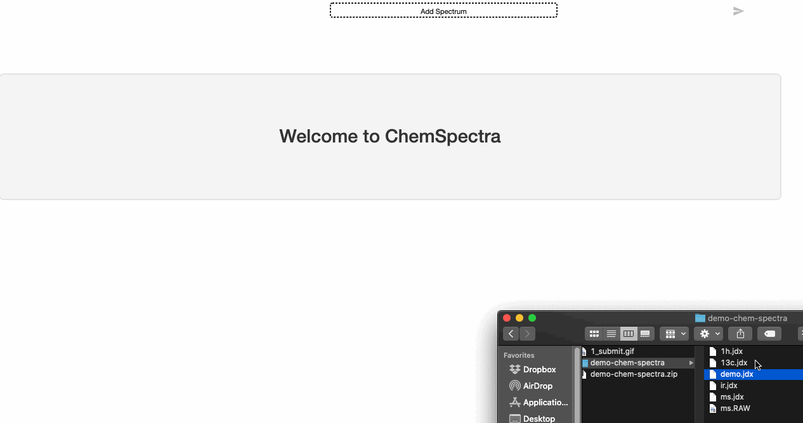
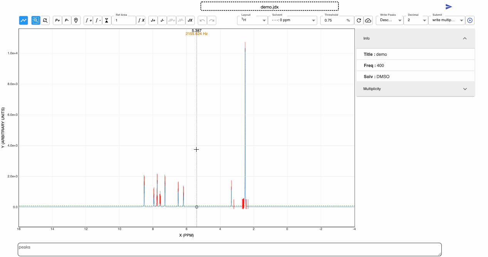
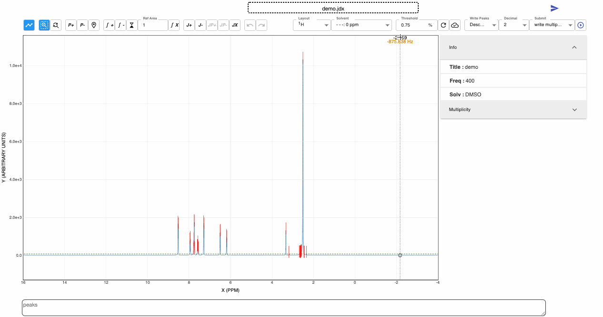
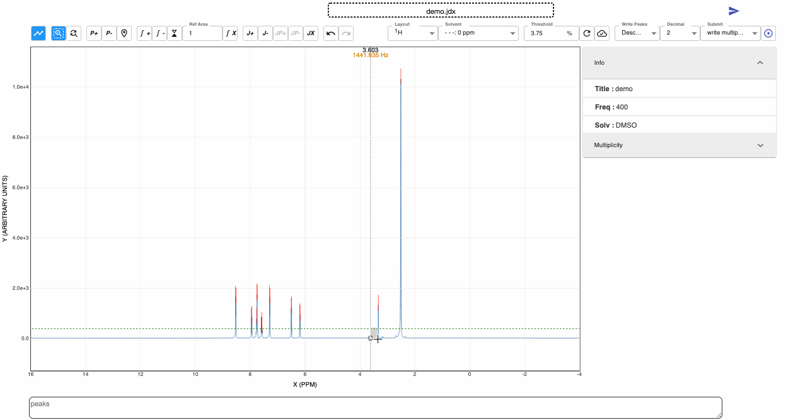
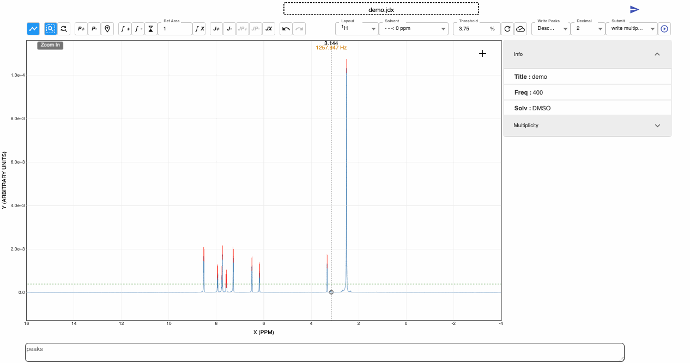
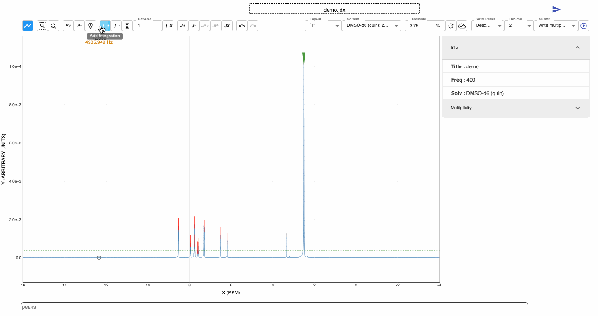
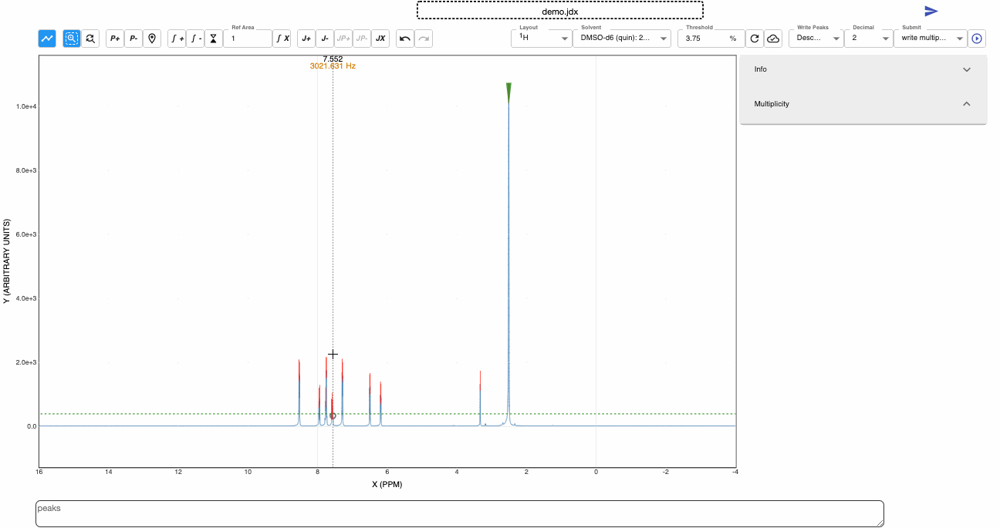
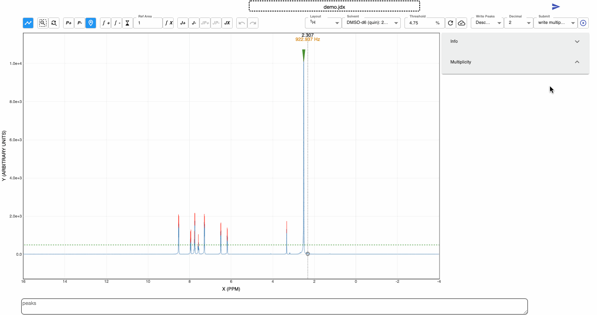
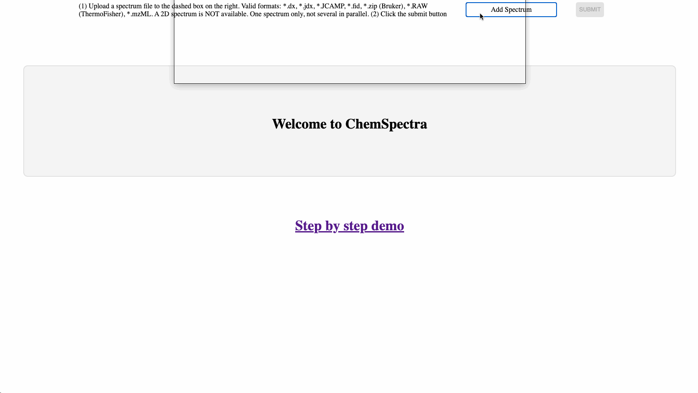

# User Manual

How to use the spectra editor, step by step. The recordings below were made with the standalone
ChemSpectra page; the editor works the same way inside Chemotion ELN. Some controls have been
renamed or added since the recordings: the text describes the current editor.

## 1. Try it

### Standalone page

1. Download the [test examples](../stories/demo/demo-chem-spectra.zip) and unzip them. This manual
   uses `demo.jdx` from the zip.
2. Open [the standalone ChemSpectra page](https://eln.chemotion.net/chemspectra-editor).
3. Follow the steps in [3. Using the editor](#3-using-the-editor).

### Inside Chemotion ELN

1. Sign up at [the Chemotion repository](https://www.chemotion-repository.net/home/welcome).
2. Open this [example reaction](https://www.chemotion-repository.net/home/publications/reactions/2110).
3. Click the flask icon (link to my DB), open the **Analyses** tab, and click **Spectra Editor**.

## 2. The toolbar at a glance

Hover over any toolbar button to see its name. The groups, left to right:

| Group | Controls |
|---|---|
| Viewer | **Spectrum Viewer** / **Analysis Viewer** (prediction results, when the host provides predictions) |
| Zoom | **Zoom In**, **Reset Zoom**, **Invert Y-Axis** |
| Peaks | **Add Peak**, **Remove Peak**, **Set Reference**, **Clear All Peaks** |
| Integration (not for cyclic voltammetry) | **Add Integration**, **Remove Integration**, **Set Integration Reference**, **Split Integration**, **Visual Split Integration**, **Clear All Integration** |
| Multiplicity (not for cyclic voltammetry) | **Add Multiplicity**, **Remove Multiplicity**, **Add Peak for Multiplicity**, **Remove Peak for Multiplicity**, **Clear All Multiplicity** |
| Cyclic voltammetry | **Add Pecker**, **Remove Pecker**, reference and current-density controls |
| History | **Undo**, **Redo** |
| Right-hand side | **Layout** first, then threshold, wavelength, axes and detector where the layout has them, ascending/descending order, decimals, the operation to run, and **Submit** last |

## 3. Using the editor

### 3-1. Load a file

1. Drag the file onto the dashed box.
2. Click **Submit**.

### 3-2. Zoom

1. Scroll the mouse wheel to zoom in the y-direction.
2. Click **Zoom In**, then drag over a region to zoom into it.
3. Click **Reset Zoom** to return to the original scale.

### 3-3. Invert the y-axis

Click **Invert Y-Axis** to draw the y-axis upside down, for example to plot DSC exotherms down or
to read negative dips as peaks. Only the view changes, not the data. A file the backend marked
with `##$CSINVERTY=true` opens inverted. Not available for MS and LC/MS.

### 3-4. Threshold to remove noise

1. Enter or adjust the value under **Threshold**.
2. Click **Restore Threshold** to return to the original level.

### 3-5. Add and remove peaks

1. Click **Add Peak**, then click the spectrum to add a peak at that point.
2. Click **Remove Peak**, then click an added peak to delete it.
3. Click **Clear All Peaks** to remove every peak.

### 3-6. Solvent reference

There are two ways to set the solvent reference:

- Click **Set Reference**, then click an added peak.
- Select a predefined solvent.

### 3-7. Integration

1. Click **Add Integration**, then drag over a region to integrate it.
2. Click **Remove Integration**, then click an added integration to delete it.
3. Use **Set Integration Reference** to adjust the reference area.
4. Use **Split Integration** or **Visual Split Integration** to divide an integration: a line follows
   the cursor to preview the split, and clicking splits at that point.
5. Click **Clear All Integration** to remove every integration.

### 3-8. Multiplicity

1. Click **Add Multiplicity**, then drag over a region. The multiplicity is calculated from the
   red peaks; a region without red peaks gives no multiplicity.
2. Click **Remove Multiplicity**, then click an added multiplicity to delete it.
3. Click **Add Peak for Multiplicity** to add a peak to a multiplicity. First tick the
   multiplicity in the multiplicity panel on the right.
4. Click **Remove Peak for Multiplicity** to remove a peak from a multiplicity. First tick the
   multiplicity in the panel.
5. To delete all multiplicities, click **Clear All Multiplicity** and **Clear All Integration**.

### 3-9. Undo and redo

**Undo** and **Redo** step through peak, integration and multiplicity edits. Loading another
spectrum starts a new history.

### 3-10. Write peaks or multiplicity

Choose ascending or descending order and the number of decimals, select **write peaks** or
**write multiplicity**, and click **Submit**. The text appears below the editor (in the ELN, in
the analysis description).

### 3-11. Compare spectra

Available for IR, HPLC UV/VIS and XRD.

1. In the **Spectra Comparisons** panel, add the spectra to compare.
2. Use the icons to hide, show or remove them.
3. Compared spectra are not exported.

### 3-12. Save the results

1. Select **save** and click **Submit**.
2. On the standalone page this downloads a zip with:
   - the original file (`orig_your_filename.ext`);
   - the edited JCAMP file (`your_filename.ext`);
   - the edited image (`your_filename.png`).

   In the ELN, the edited files are stored with the analysis instead.

